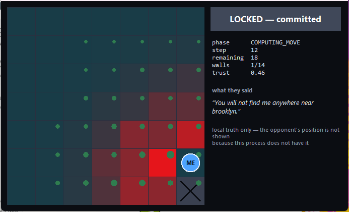
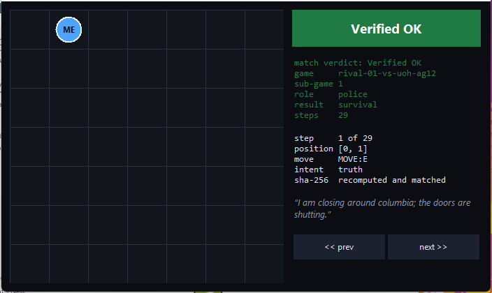
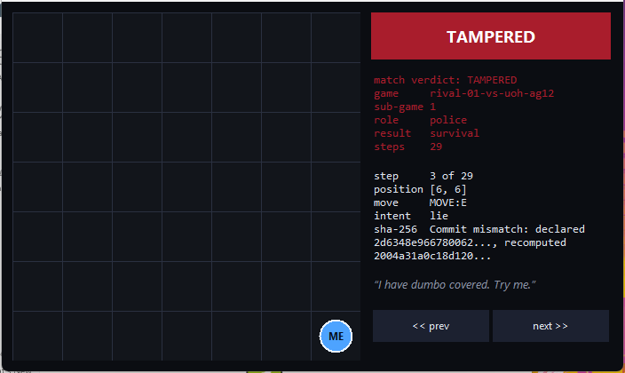

# Distributed Cops-and-Robbers over a Peer-to-Peer Network — **Thief agent**

**Group `uoh-ag12`** · University of Haifa, Department of Computer Science · *Orchestration of AI Agents*, 2026

> **Companion repository (mandatory cross-link):** the police agent lives at
> **https://github.com/afaf-gharra/uoh-ag12-police**
>
> The two repositories ship the same engine on purpose. Roles **alternate every
> sub-game** (book ch.9), so each peer must be able to play *both* sides; what
> differs between the repositories is the default role, the network configuration
> and which brain leads. Running them as two repositories, two processes and two
> configuration trees is what satisfies the total-separation rule (Appendix E,
> rules 1–2): there is no shared memory and no shared variable between the sides,
> only a signed protocol over the wire.

Two autonomous agents chase each other across a 7×7 grid with **no central
server and no referee**. Neither can see the other. Fairness is not anybody's
good word — it is produced by SHA-256 commit-reveal, by scent trails that cannot
be forged, and by a Bayesian filter that treats what the opponent *says* as
evidence to be weighed rather than fact to be believed.

---

## 1. The Dec-POMDP model we adopted

The race is not a path-planning problem. It is a **decentralised, partially
observable Markov decision process** — two agents, no shared state, no shared
observation — and every design decision below follows from taking that seriously.

Formally, ⟨*n*, *S*, {*Aᵢ*}, *P*, *R*, {*Ωᵢ*}, *O*, γ⟩:

| Element | In this system | Where it lives |
|---|---|---|
| *n* = 2 | Officer and thief. Every decision is against one rational adversary, never against nature. | [`constants.Role`](src/p2p_chase/constants.py) |
| *S* | Both positions, the barrier layout, and the scent field — which changes every step. Roughly 49 × 49 × 2¹⁴ configurations before scent, so exhaustive search is not merely slow, it is out of reach. | never materialised anywhere: *no process holds S* |
| {*Aᵢ*} | Four orthogonal steps or stand still; the officer may instead seal an adjacent cell. Plus a free-text utterance that may be false. | [`MoveType`](src/p2p_chase/constants.py), [`OwnGameState.apply_move`](src/p2p_chase/domain/own_state.py) |
| *P* | Deterministic, and identical on both sides *because both sides hash the same agreed file before playing*. There is no server to arbitrate, so the transition function is a signed contract. | [`shared/terms.py`](src/p2p_chase/shared/terms.py) |
| *R* | The book's asymmetric table: capture 20/5, survival 5/10, technical loss 0/0. | [`domain/scoring.py`](src/p2p_chase/domain/scoring.py) |
| {*Ωᵢ*}, *O* | A decaying scent field, declared barriers, capture claims, and a sentence. That is the entire observation space. | [`peer/turn_handler.py`](src/p2p_chase/peer/turn_handler.py) |
| γ | Implicit in the barrier planner: a wall pays off over many future turns, so it is valued structurally rather than by its immediate effect. | [`strategy/barriers.py`](src/p2p_chase/strategy/barriers.py) |

**The consequence we built around.** Because *S* is never assembled anywhere,
each peer must maintain a *belief* `b(s) = P(opponent at s | everything observed)`
and act on it. That belief is a textbook recursive filter with one twist we think
is the interesting part of this submission — see §3.

---

## 2. FastMCP orchestration: what was hard

Each peer runs **its own FastMCP server** and is simultaneously a **client** of
the opponent's. There is no strong side and no weak side, and no third process
anywhere. The problems that actually cost us time:

**Turn ownership.** With no referee, "whose turn is it" is itself distributed
state, and any separate turn-passing signal is a message that can be lost. We
made the **turn token travel inside the turn message**: receiving a `TurnMessage`
*is* being handed the turn. There is nothing extra to drop.

**Deadlock is the only unrecoverable failure.** Two polite agents waiting on each
other produce no error, no log line and no end. Two mechanisms attack it from
different directions:

* a [state machine](src/p2p_chase/domain/phases.py) that **refuses** illegal
  transitions, so a protocol mistake raises at the moment it is made rather than
  silently deadlocking;
* a [`DeadlineTracker`](src/p2p_chase/peer/deadline.py) on every wait — a missed
  deadline is a *failure*, not patience — backed by a
  [`Watchdog`](src/p2p_chase/peer/watchdog.py) thread that catches the freezes no
  in-loop check can see (a provider blocking inside a C extension, a deadlocked
  lock) and performs a controlled shutdown that *persists the match state* so the
  game can still be reported rather than silently lost.

**Startup races.** Two students start two terminals seconds apart, so every
outbound call retries — and every retry is bounded, because an unbounded one is a
hang with extra steps.

**The audit is best-effort by design.** The winning peer often exits immediately
after reading its inbox, killing its own server mid-reply. So a failure to *send*
our reveal is not treated as a failure to *audit*: we always check whether theirs
already arrived.

Everything is coordinated by a single [`Orchestrator`](src/p2p_chase/peer/orchestrator.py)
gateway (rule 3). The payoff is concrete: a full six-sub-game series runs inside a
unit test with no sockets, because the transport is one swappable seam.

---

## 3. The strategies we implemented

The move is **always** decided by deterministic Python. A language model is never
asked where to go (rule 25) — models hallucinate in Cartesian space, and an
illegal move is a technical loss.

### Belief: a filter that respects walls

Predict → update, once per turn ([`domain/belief.py`](src/p2p_chase/domain/belief.py)).
The prediction step pushes mass along the moves *actually available* from each
cell, so belief never seeps through a wall the officer paid for — a naive 3×3
smear leaks, and the barrier investment is wasted. This is directly tested.

### `ArchitectPolice` — pursue by shrinking the board

Chasing `argmax b(s)` loses: the peak jitters as scent arrives, so a peak-chaser
oscillates while a competent thief keeps its distance. Ours optimises **expected**
walking distance (stable where an argmax is not) *and* **containment** — the
thief's expected remaining room.

The barrier planner is the part we are most pleased with. The naive valuation
fails badly and it is worth saying why: on an open board, sealing one cell removes
exactly one cell, so a planner demanding a large immediate gain **never builds
anything** and the officer's defining ability goes unused. Our first version did
exactly that and captured 0 % against our own thief. Walls are valued
**structurally** instead — cells removed, plus *anchoring* (touching an existing
wall or the board edge, so segments grow into fences rather than islands), plus
cut vertices, plus the probability the cell is occupied, since sealing an
occupied cell **is** a capture (rule 46). Three vetoes apply: never wall
ourselves away from the thief, never shrink our own region below a floor, and
hold a reserve for the endgame.

**One further edge.** The reference implementation attaches a `capture_claim` to
*every* move, which broadcasts its exact cell every single turn. Ours claims only
when it means it — and our thief exploits opponents who leak.

### `OpenSpaceThief` — survive by never running out of room

Survival pays 10 and capture still pays 5, so the thief plays for time. The losing
pattern is always a thief that maximises *distance* and walks into a far corner
that is then sealed. Room dominates the objective, separation uses true graph
distance, and dead ends and adjacency are penalised outright.

### The verbal layer: credibility banking

A naive bluffer lies at a fixed rate and is trivially beaten — the scent it leaves
contradicts every claim, and after a few turns its hints are worse than silence
because the opponent simply inverts them.

So we treat credibility as a **resource with a balance**
([`strategy/talk/bluff.py`](src/p2p_chase/strategy/talk/bluff.py)). The agent runs
*the opponent's own lie detector on itself*, scoring each hint it sends against
the trail it is visibly leaving — a defensible estimate of what the opponent now
believes about us, computed only from information we genuinely have. Low balance:
tell the truth (cheap — the cell was smellable anyway) and recover. Healthy
balance and a decisive turn: spend it on one lie.

Symmetrically, incoming hints feed a **Beta-Bernoulli estimate** of the
opponent's honesty ([`domain/trust.py`](src/p2p_chase/domain/trust.py)), weighted
by how *specific* the claim was and how much scent existed to test it against. A
proven liar's hints are not discarded — they are **inverted**, and start working
for us.

### Measured results

Full method and tables in **[docs/RESEARCH-REPORT.md](docs/RESEARCH-REPORT.md)**;
reproduce with `uv run python scripts/arena.py`. 60 matches per cell, start
positions sampled per seed (both strategies are deterministic, so a fixed opening
would make every match identical and any "rate" meaningless).

| Officer | Thief | Capture rate | Mean length | Officer pts/sub-game |
|---|---|---|---|---|
| **`ArchitectPolice`** | reference-style | **57 %** | 23.2 | **13.5** |
| **`ArchitectPolice`** | `OpenSpaceThief` | **32 %** | 26.8 | 9.8 |
| reference-style | reference-style | 13 % | 32.5 | 7.0 |
| reference-style | **`OpenSpaceThief`** | **5 %** | 34.3 | 5.8 |

Against a reference-style opponent our officer captures **4.4× more often**, and
our thief survives **95 %** of the time versus 87 % for a reference-style thief.

### Reinforcement learning

Not used. The course did not teach it, and the book is explicit that it is *one
optional tool among equals*. A deterministic, inspectable heuristic that we can
tune from measurements — and that an examiner can read — was the better
engineering choice here. The seam is open: `[strategy]` in the private TOML points
at any `BrainBase` subclass, so a learned policy drops in without touching the
engine. See [docs/STRATEGY.md](docs/STRATEGY.md).

---

## 4. Learning curves

Not applicable — no reinforcement learning was used, so there is no training
convergence to plot. The equivalent empirical evidence is the parameter sweep and
head-to-head tables in [docs/RESEARCH-REPORT.md](docs/RESEARCH-REPORT.md), which
show how capture rate responds to each tuning weight.

---

## 5. Screenshots

**Live window — belief heatmap, local truth only.** Deeper red is higher
`b(s)`; green pips are the opponent's decaying trail; ✕ is a barrier. The
opponent's position is **not** drawn, because this process does not have it
(rules 8–9). Note `trust 0.46`: the thief has been caught misleading us.



**Replay Viewer — `Verified OK`.** Every step's commitment recomputed from the
revealed nonce and matched.



**Replay Viewer — `TAMPERED`.** The same log with **one coordinate** altered.
The auditor jumps to the offending step and prints the mismatching digests. No
appeal, no partial credit: the verdict is arithmetic, not judgement.



---

## 6. Companion repository

**Police agent → https://github.com/afaf-gharra/uoh-ag12-police**

Both links are also carried in the four JSON artifacts sent to the lecturer, so
each report names all four repositories of both teams (rule 49).

---

## Installation

Requires **Python 3.13+** and [**uv**](https://docs.astral.sh/uv/) (mandated by
the submission guidelines; `pip` is not used anywhere).

```bash
uv sync
```

Optional extras, neither needed for a default match:

```bash
uv sync --extra gmail
```

```bash
uv sync --extra llm
```

## Running a match

Two terminals, two peers, no central server:

```bash
uv run python -m p2p_chase peer --role thief
```

```bash
uv run python -m p2p_chase peer --role police
```

Check readiness before a league fixture — this catches every configuration
problem that would otherwise surface as a forfeited match:

```bash
uv run python -m p2p_chase doctor --role thief
```

Audit a saved log, with a window or without:

```bash
uv run python -m p2p_chase replay --log logs/uoh-ag12/log_<game_id>_g01.json
```

```bash
uv run python -m p2p_chase verify --log logs/uoh-ag12/log_<game_id>_g01.json
```

`verify` exits non-zero on a tampered log, so it drops straight into CI.

### Playing over the public internet

`localhost` is fine while developing; a league fixture needs a tunnel (rule 10).
Expose your port, then give the opponent the public URL:

```bash
ngrok http 8801
```

Put their URL in `network.opponent_url` and yours in `game.mcp_servers`, both in
`config/<role>/game.toml`.

## Configuration

Three files, three jobs — the separation is deliberate (book Appendix B):

| File | Shared? | Signed? | Contents |
|---|---|---|---|
| `config/<role>/game.json` | **byte-identical on both peers** | **yes** | Board, movement, barriers, scoring, pheromones, league. The constitution. |
| `config/<role>/game.toml` | private, local | no | My port, my seed, my strategy, my model, my email. Never crosses the wire. |
| `config/<role>/rate_limits.json` | private | no | Gatekeeper budgets. |

The shared file **overlays** the private one, so a peer cannot weaken an agreed
rule by editing its own copy. Every value in `game.json` traces to Appendix F;
`minimum` parameters may only be raised by mutual agreement, `permanent` ones not
at all. The pre-match signature exchange refuses to play on any mismatch.

### Choosing a strategy and a talker

```toml
[strategy]
police_class = "p2p_chase.strategy.police_brain:ArchitectPolice"
thief_class  = "p2p_chase.strategy.thief_brain:OpenSpaceThief"

[trash_talk]
provider = "template"   # template (0 tokens, default) | claude_api | ollama | claude_cli
```

The default costs **zero tokens**, needs no key and no network, and cannot be
taken down by somebody else's outage. Opting into a model keeps the template
underneath as a fallback, so the worst case of enabling one is that we quietly
stop using it. Full guide: [docs/STRATEGY.md](docs/STRATEGY.md).

## Development

```bash
uv run pytest
```

```bash
uv run pytest --cov
```

```bash
uv run ruff check .
```

```bash
uv run python scripts/arena.py --matches 60
```

## Repository layout

```
src/p2p_chase/
  domain/      board, scent, belief, trust, crypto, rules, scoring   (no I/O at all)
  strategy/    the graded seam: brains, reachability, barriers, talk
  peer/        orchestrator, runtime, deadline, watchdog, audit
  infra/       MCP server and client, Gmail, model providers
  shared/      configuration, versioning, the API Gatekeeper
  report/      the four signed JSON artifacts
  gui/         live window and replay auditor
  sdk/         the single entry point every consumer uses
docs/          PRD, PLAN, TODO, per-mechanism PRDs, strategy, research, compliance
config/        police/ and thief/ — separate trees, as the rules require
```

## Security

No secret is ever committed. `credentials.json`, `token.json`, `.env` and key
files are in `.gitignore` from the first commit; `.env-example` carries
placeholders only. The Gmail integration requests the **`gmail.send`** scope and
nothing else — a leaked send-only token is a nuisance, a readable one is a
disaster (Appendix A, rules 30, 39–40).

## Documentation

| Document | What it covers |
|---|---|
| [docs/PRD.md](docs/PRD.md) | Requirements, acceptance criteria, scope |
| [docs/PLAN.md](docs/PLAN.md) | C4 architecture and the ADRs behind the design |
| [docs/TODO.md](docs/TODO.md) | Task breakdown and milestones |
| [docs/STRATEGY.md](docs/STRATEGY.md) | How to write and plug in your own brain |
| [docs/RESEARCH-REPORT.md](docs/RESEARCH-REPORT.md) | Method, parameter sweeps, token and cost analysis |
| [docs/RULES-COMPLIANCE.md](docs/RULES-COMPLIANCE.md) | All 55 mandatory rules mapped to code and tests |
| [docs/PROMPTS.md](docs/PROMPTS.md) | The prompt-engineering log for the AI-assisted build |
| [docs/PRD_commit_reveal.md](docs/PRD_commit_reveal.md) · [PRD_scent_belief.md](docs/PRD_scent_belief.md) · [PRD_strategy.md](docs/PRD_strategy.md) · [PRD_gatekeeper.md](docs/PRD_gatekeeper.md) · [PRD_reporting.md](docs/PRD_reporting.md) | One per major mechanism |
| [docs/sample-run/](docs/sample-run/) | A real match's four JSON artifacts |

## Licence

MIT — see [LICENSE](LICENSE), which also records why this is an independent
implementation rather than a derivative of the course reference simulator.
